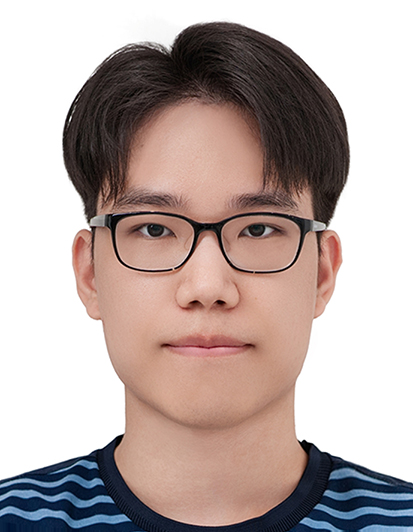
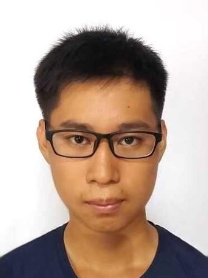
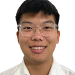
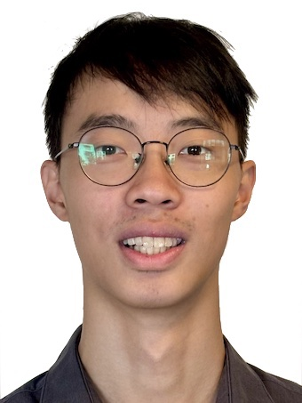

# About Us

We are a team based in the [School of Computing, National University of Singapore](http://www.comp.nus.edu.sg).

You can reach us at the email `seer[at]comp.nus.edu.sg`

## Project team

### Keith Tay

[[github](https://github.com/keitht8y)]
[[portfolio](team/johndoe.md)]

* Role: Associate Integration Specialist
* Responsibilities: Integration & Testing

### Jinho Son

[[github](http://github.com/johndoe)]
[[portfolio](team/johndoe.md)]

* Role: Integration
* Responsibilities: In charge of versioning of the code, maintaining the code repository, integrating various parts of the software to create a whole

### Orion Raysher Lee

[[github](http://github.com/its-me-orion)] [[portfolio](team/johndoe.md)]

* Role: Developer and testing
* Responsibilities: Testing

### Zechariah Yeo

[[github](https://github.com/not-a-scam)]
[[portfolio](team/johndoe.md)]

* Role: Integration
* Responsibilities: Dev Ops + Code Quality

### Benjamin Lua

[[github](http://github.com/lkxben)]
[[portfolio](team/johndoe.md)]

* Role: Testing
* Responsibilities: Dev Ops + Threading
>>>>>>> master
