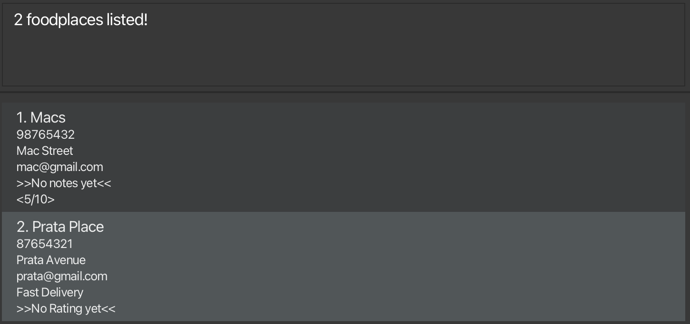

# AB-3 User Guide

AddressBook Level 3 (AB3) is a **desktop app for managing contacts, optimized for use via a  Line Interface** (CLI) while still having the benefits of a Graphical User Interface (GUI). If you can type fast, AB3 can get your contact management tasks done faster than traditional GUI apps.

<!-- * Table of Contents -->
<page-nav-print />

--------------------------------------------------------------------------------------------------------------------

## Quick Start

Follow these steps to install and start using **BiteBuddy**!

### Step 1 — Check Java Version
- Ensure you have Java `17` or above installed on your computer. 
   **Windows users:** Java `17` can be downloaded [here](https://www.oracle.com/java/technologies/downloads/#java17-windows).  
   **Mac users:** Ensure you have the precise JDK version prescribed [here](https://se-education.org/guides/tutorials/javaInstallationMac.html).  
- To check your version, open a terminal and type: `java -version`

### Step 2 — Download and Run BiteBuddy
1. Go to our [GitHub Releases page](https://github.com/AY2526S1-CS2103T-W14-2/tp/releases).
2. Download the latest file named **`bitebuddy.jar`**.
   
3. Copy the file to the folder you want to use as the _home folder_ for your BiteBuddy.
4. Open a command terminal, navigate (`cd`) to the folder where you placed the `BiteBuddy.jar` file, and run the command `java -jar "bitebuddy.jar"` to launch the application.   
   You can also open the terminal **directly from the folder** by right-clicking it and selecting **“Open in Terminal”**.  
   **Mac users:**   
   **Windows users:** 

5. A GUI similar to the one below should appear within a few seconds. It comes preloaded with sample data for you to explore.  
    

### Step 3 — Try Out a Command!
- Type the command in the Command Box and press Enter to execute it. e.g. typing **`help`** and pressing Enter will open the help window.  
  Here are some example commands you can try:

   * `list` : Lists all foodplaces.

   * `add n/KFC a/John street, block 123, #01-01 t/FastFood t/Chicken r/8` : Adds the foodplace *KFC* to BiteBuddy.

   * `delete 3` : Deletes the 3rd foodplace shown in the current list.

   * `clear` : Deletes all saved foodplaces.

   * `exit` : Exits BiteBuddy.

- Refer to the [Features](#features) below for details of each command.

--------------------------------------------------------------------------------------------------------------------

## Features

<box type="info" seamless>

**Notes about the command format:** 

* Words in `UPPER_CASE` are the parameters to be supplied by the user. 
  e.g. in `add n/NAME`, `NAME` is a parameter which can be used as `add n/John Doe`.

* Items in square brackets are optional. 
  e.g `n/NAME [t/TAG]` can be used as `n/John Doe t/friend` or as `n/John Doe`.

* Items with `…`​ after them can be used multiple times including zero times. 
  e.g. `[t/TAG]…​` can be used as ` ` (i.e. 0 times), `t/friend`, `t/friend t/family` etc.

* Parameters can be in any order. 
  e.g. if the command specifies `n/NAME p/PHONE_NUMBER`, `p/PHONE_NUMBER n/NAME` is also acceptable.

* Extraneous parameters for commands that do not take in parameters (such as `list`, `exit` and `clear`) will be ignored. 
  e.g. if the command specifies `list 123`, it will be interpreted as `list`.

* If you are using a PDF version of this document, be careful when copying and pasting commands that span multiple lines as space characters surrounding line-breaks may be omitted when copied over to the application.
</box>

### Viewing help : `help`

Directs user to detailed information about the application or specific commands.

Format: `help [COMMAND]`  

* If no command is given, the URL for the help page will be shown. 
* If a command parameter is given, the usage for the command will be shown
* Command keywords are case sensitive

Examples:  
* `help` shows the help page
* `help add` shows the usage for the `add` command  

[Go to Command Summary](#command-summary)

### Adding a foodplace: `add`

Adds a foodplace to the address book.

Format: `add n/NAME p/PHONE_NUMBER e/EMAIL a/ADDRESS [c/CUISINE] [t/TAG]… [no/NOTE] [r/RATING]​`

<box type="tip" seamless>

**Tip:** A foodplace can have any number of tags (including 0)
</box>

Examples:
* `add n/John Doe p/98765432 e/johnd@example.com a/John street, block 123, #01-01`
* `add n/Betsy Crowe t/friend e/betsycrowe@example.com a/Newgate Prison p/1234567 t/criminal`

[Go to Command Summary](#command-summary)

### Listing all foodplaces : `list`

Shows a list of all foodplaces in the address book.

Format: `list`

### Deleting a foodplace : `delete`

Deletes the specified foodplace from the address book.

Format: `delete INDEX`

* Deletes the foodplace at the specified `INDEX`.
* The index refers to the index number shown in the displayed foodplace list.
* The index **must be a positive integer** 1, 2, 3, …​

Examples:
* `list` followed by `delete 2` deletes the 2nd foodplace in the address book.
* `find Betsy` followed by `delete 1` deletes the 1st foodplace in the results of the `find` command.

[Go to Command Summary](#command-summary)  

### Editing a foodplace : `edit`

Edits an existing foodplace in the address book.

Format: `edit INDEX [n/NAME] [p/PHONE] [e/EMAIL] [a/ADDRESS] [c/CUISINE] [t/TAG]… [no/NOTE] [r/RATING]​`

* Edits the foodplace at the specified `INDEX`. The index refers to the index number shown in the displayed foodplace list. The index **must be a positive integer** 1, 2, 3, …​
* At least one of the optional fields must be provided.
* Existing values will be updated to the input values.
* When editing tags, the existing tags of the foodplace will be removed i.e adding of tags is not cumulative.
* You can remove all the foodplace’s tags by typing `t/` without
    specifying any tags after it.

Examples:
*  `edit 1 p/91234567 e/johndoe@example.com` Edits the phone number and email address of the 1st foodplace to be `91234567` and `johndoe@example.com` respectively.
*  `edit 2 n/Betsy Crower t/` Edits the name of the 2nd foodplace to be `Betsy Crower` and clears all existing tags.

[Go to Command Summary](#command-summary)  

### Adding a note to a foodplace : `note`

Adds / edits the note of an existing foodplace in the address book.

Format: `note INDEX [note]`

* Edits the foodplace at the specified `INDEX`. The index refers to the index number shown in the displayed foodplace list. The index **must be a positive integer** 1, 2, 3, …​
* You can remove the foodplace’s notes by not specifying any notes after `INDEX`.
* Note have a maximum character limit of 100.
* Note only allows ASCII-printable characters. You may refer to [here](http://facweb.cs.depaul.edu/sjost/it212/documents/ascii-pr.htm) for the characters that are accepted.

Examples:
* `note 2 Good customer service!` Adds / Edits the note of the 2nd foodplace to be `Good customer service!`.
* `note 2` Removes any notes of the 2nd foodplace.

[Go to Command Summary](#command-summary)  

### Rate a foodplace : `rate`

Assigns/Removes an optional rating from the specified foodplace in the address book.

Format: `rate INDEX RATING`

* Finds the foodplace at the specified `INDEX`.
* The index refers to the index number shown in the displayed foodplace list.
* The index **must be a positive integer** 1, 2, 3, …​
* Sets the rating of the found foodplace to the specified `RATING`.
* The rating **must be an integer between 0 and 10** e.g. 0, 1, 2, …​

Examples:
* `list` followed by `rate 2 5` sets the 2nd foodplace in the address book to have a rating of 5.
* Executing `rate 1 0` sets the 1st foodplace in the addressbook to have its current rating removed.
* Executing `rate 1 5` then `rate 1 8` sets the 1st foodplace in the addressbook to have its current rating to `5`
  first then to `8`.

[Go to Command Summary](#command-summary)  

### Adding Tag(s) to a foodplace : `tag`

Adds or removes one or more tags from the specified foodplace in the address book.

Format 1 : `tag INDEX TAG1 [TAG2]...`  
Format 2 : `tag INDEX /d [TAG1] [TAG2]...`

* Finds the foodplace at the specified `INDEX` and edits its tags.
* At least one tag must be provided for Format 1.
* Multiple tags can be added at once using Format 1.
* Tag additions are cumulative (existing tags are kept unless deleted).

Examples:  
* `tag 3 FastFood Vegan` adds both FastFood and Vegan tags to the 3rd foodplace.
* `tag 2 /d FastFood` removes the FastFood tag from the 2nd foodplace.

<box type="tip" seamless>

**Tip:** Using `tag INDEX /d` without specifying any tags will remove all tags from the selected foodplace.
</box>

[Go to Command Summary](#command-summary)  

### Locating foodplaces by name: `find`

Finds foodplaces whose name, phone, email, address, note, rating, or tags contain any of the given keywords.

Format: `find KEYWORD [MORE_KEYWORDS]`

* The search is case-insensitive. e.g `prata` will match `Prata`
* The order of the keywords does not matter. e.g. `Prata Place` will match `Place Prata`
* Keywords are matched against multiple fields.
* The search uses substring matching. e.g. `Pr` will match `Prata`
* Foodplaces matching at least one keyword will be returned (i.e. `OR` search).

Examples:
* `find prata` returns `Prata Place` and `The Prata House`
* `find delivery 5` returns foodplaces with either “delivery” or “5” appearing in any field 
  

[Go to Command Summary](#command-summary)  

### Clearing all entries : `clear`

Clears all entries from the address book.

Format: `clear`

### Exiting the program : `exit`

Exits the program.

Format: `exit`

### Saving the data

AddressBook data are saved in the hard disk automatically after any command that changes the data. There is no need to save manually.

### Editing the data file

AddressBook data are saved automatically as a JSON file `[JAR file location]/data/addressbook.json`. Advanced users are welcome to update data directly by editing that data file.

<box type="warning" seamless>

**Caution:**
If your changes to the data file makes its format invalid, AddressBook will discard all data and start with an empty data file at the next run.  Hence, it is recommended to take a backup of the file before editing it. 
Furthermore, certain edits can cause the AddressBook to behave in unexpected ways (e.g., if a value entered is outside the acceptable range). Therefore, edit the data file only if you are confident that you can update it correctly.
</box>

--------------------------------------------------------------------------------------------------------------------

## FAQ

**Q**: How do I transfer my data to another Computer? 
**A**: Install the app in the other computer and overwrite the empty data file it creates with the file that contains the data of your previous BiteBuddy home folder.

--------------------------------------------------------------------------------------------------------------------

## Known issues

1. **When using multiple screens**, if you move the application to a secondary screen, and later switch to using only the primary screen, the GUI will open off-screen. The remedy is to delete the `preferences.json` file created by the application before running the application again.
2. **If you minimize the Help Window** and then run the `help` command (or use the `Help` menu, or the keyboard shortcut `F1`) again, the original Help Window will remain minimized, and no new Help Window will appear. The remedy is to manually restore the minimized Help Window.

--------------------------------------------------------------------------------------------------------------------

## Command summary

Action     | Format                                                                     | Examples
-----------|----------------------------------------------------------------------------|---------------------------------------------------------------------------------------------------------------------------------------------------------
[**Help**](#viewing-help--help) | `help [COMMAND]`                                                        | `help add`
[**Add**](#adding-a-foodplace-add) | `add n/NAME p/PHONE_NUMBER e/EMAIL a/ADDRESS [t/TAG]…​`                 | `add n/James Ho p/22224444 e/jamesho@example.com a/123, Clementi Rd, 1234665 t/friend t/colleague`
[**List**](#listing-all-foodplaces--list) | `list`                                                                     | `list`
[**Delete**](#deleting-a-foodplace--delete) | `delete INDEX`                                                          | `delete 3`
[**Edit**](#editing-a-foodplace--edit) | `edit INDEX [n/NAME] [p/PHONE_NUMBER] [e/EMAIL] [a/ADDRESS] [t/TAG]…​`  | `edit 2 n/James Lee e/jameslee@example.com`
[**Note**](#adding-a-note-to-a-foodplace--note)   | `note INDEX [NOTE]`                                                     | `note 1 Famous for their chicken rice!`
[**Rate**](#rate-a-foodplace--rate) | `rate INDEX RATING`                                                     | `rate 1 6`
[**Tag**](#adding-tags-to-a-foodplace--tag) | `tag INDEX TAG1 [TAG2]…​`  `tag INDEX /d [TAG]…​`                    | `tag 1 FastFood Expensive`  `tag 1 /d FastFood`
[**Find**](#locating-foodplaces-by-name-find) | `find KEYWORD [MORE_KEYWORDS]`                                          | `find James Jake`
[**Clear**](#clearing-all-entries--clear) | `clear`                                                                    | `clear`
[**Exit**](#exiting-the-program--exit) | `exit`                                                                     | `exit`
