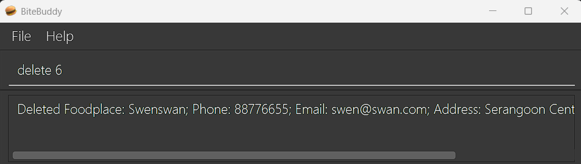
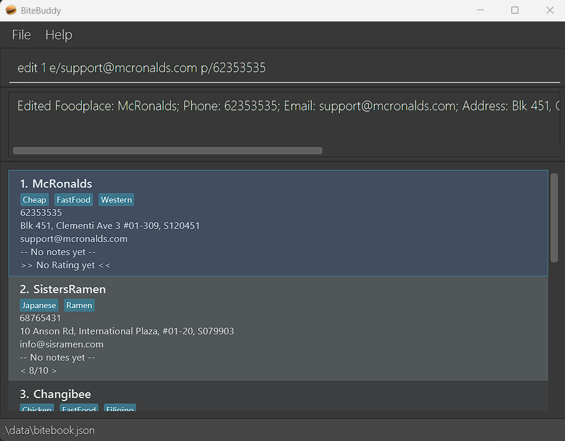
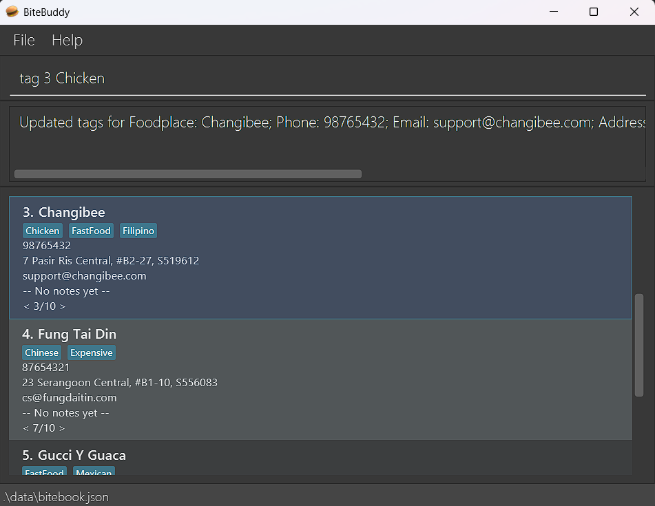
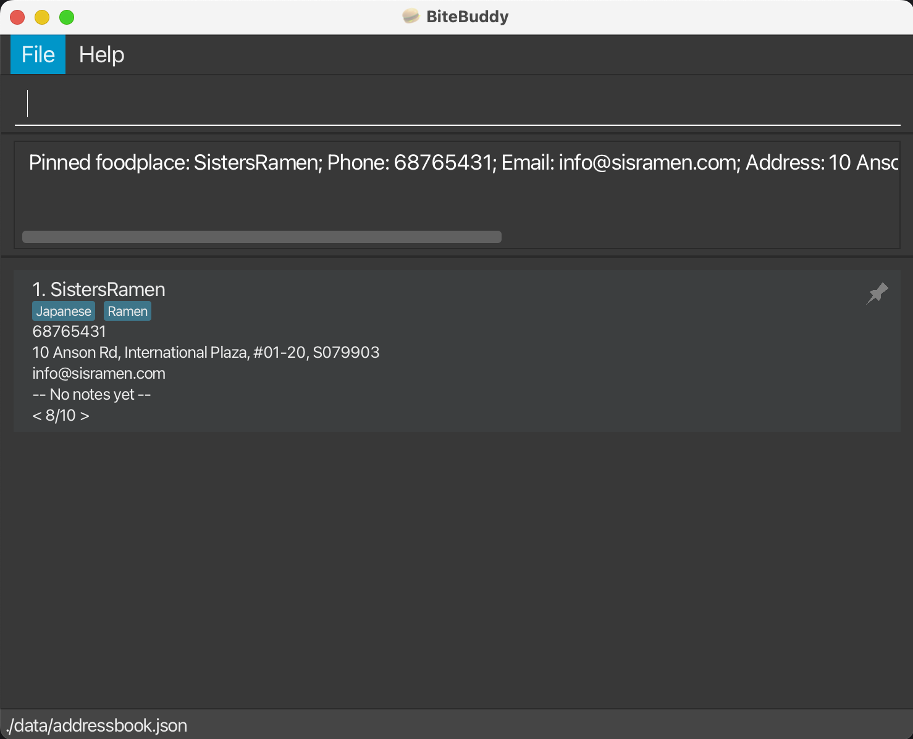
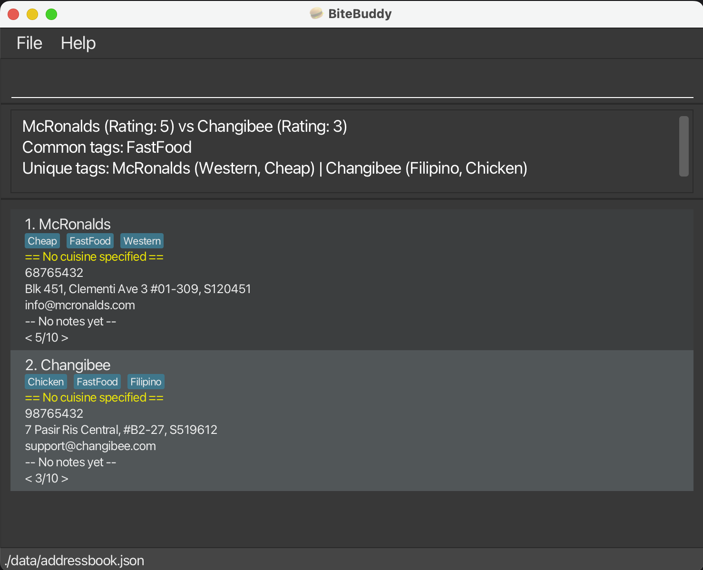

# BiteBuddy User Guide

## Table of contents
- [Introduction](#introduction)
- [Quick Start](#quick-start)
- [Features](#features)
  - [`help` - Viewing help](#viewing-help-help)
  - [`add` - Adding a foodplace](#adding-a-foodplace-add)
  - [`list` - Listing all foodplaces](#listing-all-foodplaces-list)
  - [`delete` - Deleting a foodplace](#deleting-a-foodplace-delete)
  - [`edit` - Editing a foodplace](#editing-a-foodplace-edit)
  - [`note` - Adding a note to a foodplace](#adding-a-note-to-a-foodplace-note)
  - [`rate` - Rating a foodplace](#rating-a-foodplace-rate)
  - [`tag` - Tagging a foodplace](#adding-tags-to-a-foodplace-tag)
  - [`wishlist` - Wishlisting a foodplace](#wishlisting-a-foodplace-wishlist)
  - [`blacklist` - Blacklisting a foodplace](#blacklisting-a-foodplace-blacklist)
  - [`pin` - Pinning a foodplace](#pinning-a-foodplace-pin)
  - [`unpin` - Unpinning a foodplace](#unpinning-a-foodplace-unpin)
  - [`find` - Finding a foodplace](#finding-a-foodplace-find)
  - [`compare` - Compare two foodplaces](#comparing-two-foodplaces-compare)
  - [`clear` - Delete all foodplaces](#clearing-all-entries-clear)
  - [`exit` - Quit the program](#exiting-the-program-exit)
- [FAQ](#faq)
- [Known issues](#known-issues)
- [Command summary](#command-summary)


## Introduction

_Have you ever tried thinking back to that amazing food place you had before, but couldn't quite get a hold of it before it slipped your mind?_<br>
_Or maybe you've just visited that newest food street, but didn't have enough time to try everything you wanted?_<br>

_Not to worry, because your **BiteBuddy** is here!_

BiteBuddy (BB) is our **food-place tracking app for recording all your food places, optimized for use via a Command Line Interface** (CLI).  While still having the benefits of a Graphical User Interface (GUI), BiteBuddy is a CLI-oriented application, meaning the faster you type, the faster BiteBuddy goes!<br>
BiteBuddy is **designed by foodies, for the foodies**! Add your go-to _(and not so favourite)_ food places so that you know exactly where to revisit _(and to avoid)_ in future! BiteBuddy minimally requires the name and address of a place but for the more adventurous users, you can expand more on the place such as:
- Jotting additional notes for your food places!
- Tagging your entries for identifying overlaps between places with a quick glance!
- Adding a rating so you know exactly where that restaurant stands in your own records!
- and more!

<br>For the power users, there are even more things to explore, including:
- Adding new food places with all additional features in one inline command
- Finding keyword matches across all your food places in a blink of an eye
- Edit any entry any time to fix those pesky typos
- Use the `find` command to filter results, before chaining the `edit` command on the filtered results!

Curious? Give the app a try!<br>
Check out the [Quick Start](#quick-start) section right below!

<!-- * Table of Contents -->
<page-nav-print />

--------------------------------------------------------------------------------------------------------------------

## Quick Start

Follow these steps to install and start using **BiteBuddy**!

### Step 1 — Check Java Version
- Check that you have Java `17` or above installed on your computer.<br>
   **On Windows 🪟:** Java `17` can be downloaded [here](https://www.oracle.com/java/technologies/downloads/#java17-windows).<br>
   **On Mac 🍎:** Check that you have the JDK version prescribed [here](https://se-education.org/guides/tutorials/javaInstallationMac.html).
- To check your Java version on any system, open a terminal and type: `java -version`


### Step 2 — Download and Run BiteBuddy
1. Head over to our [GitHub Releases page here](https://github.com/AY2526S1-CS2103T-W14-2/tp/releases)!
2. Download the latest file named **`bitebuddy.jar`**. There may be other files shown, but you'll only need `bitebuddy.jar`.
   
3. Choose a folder you want to use as the **home folder** for your BiteBuddy installation, choosing any folder is fine! Then, place `bitebuddy.jar` in this folder.
4. In your file explorer, right-click an empty space and select **“Open in Terminal”** to start a command terminal directly from this folder. We will be using this terminal over the next steps!<br>
   *If the above didn't work, stay calm and don't panic!*<br>
   Open a command terminal (`cmd` for Windows or `Terminal` for Mac), then type in `cd YOUR/FILE/PATH` while replacing `YOUR/FILE/PATH` with where you've placed the folder holding `bitebuddy.jar` and hit your 'Enter' key.<br>
   Then, type in the command `java -jar "bitebuddy.jar"` and hit your 'Enter' key to start BiteBuddy!<br>
   **Mac users:** 
   **Windows users:** 
   

5. After BiteBuddy starts, you'll soon be greeted by a window similar to the one below. There'll be some sample foodplaces provided to get you started! <br>
   

### Step 3 — Try Out a Command!
- To get started, in the Command Box, try typing **`help`** and hitting 'Enter' to open the help window!<br>
  This will be how commands are ran: *type a command in the Command Box and press the 'Enter' key to execute it*.<br>
  Here are some example commands you can try to get the ball rolling:

   * `list` : This shows you all foodplaces in BiteBuddy!

   * `add n/KFC a/John street, block 123, #01-01 t/FastFood t/Chicken r/8` : This adds a new foodplace called *KFC* to BiteBuddy.

   * `delete 3` : This deletes the 3rd foodplace shown in the current list.

   * `find KFC` : This gets a list of all places that have the keyword '*KFC*' in BiteBuddy.

   * `exit` : This saves BiteBuddy's data and exits BiteBuddy.

- For details of each command, refer to the [Features](#features) below.

--------------------------------------------------------------------------------------------------------------------

## Features

<box type="info" seamless>

**Notes about the command format:**<br>

* You have to replace the words in `UPPER_CASE` as your input parameters. Different parameters have different rules, check out the commands' section below if you need help!<br>
  e.g. in `add n/NAME`, `NAME` is a parameter here, so you can use it as `add n/KFC`.

* Items in square brackets are optional, meaning you don't always have to provide these!<br>
  e.g `n/NAME [t/TAG]` can be used as `n/KFC t/fried` or as `n/KFC`.

* Items with `…`​ after them can be used any number of times, including not at all.<br>
  e.g. `[t/TAG]…​` can be an empty space (` `, i.e. 0 times), `t/famous`, `t/famous t/hawker` etc.

* The order of all input parameters doesn't matter.<br>
  e.g. if the command specifies `n/NAME p/PHONE_NUMBER`, `p/PHONE_NUMBER n/NAME` is also accepted!

* Additional input parameters for commands that do not expect any will be ignored (e.g. `list`, `exit` and `clear`).<br>
  e.g. if the command specifies `list 123`, it will be interpreted as just `list`.

* All timings must follow the HH:mm 24-hour format.<br>
  e.g. 12pm should be typed as `12:00` and 7pm should be typed as `19:00`.

* If you are using a PDF version of this document, be careful when copying and pasting commands that span multiple lines as space characters surrounding line-breaks may be omitted when copied over to the application.

**Using previously entered commands:**<br>

* Hate retyping commands? Press the `↑` / `↓` arrow keys in the command box!

* Swap between your previously-used and currently-typing-in-progress commands!

</box>

---

### Viewing help: `help`

Directs user to detailed information about the application or specific commands.

Format: `help [COMMAND]`

```
help: Shows program usage instructions.
Parameters:
  [COMMAND] 
Examples:
  help
  help find
```

* If no command is given, the URL for the help page will be shown. 
* If a command parameter is given, the usage for the command will be shown instead.
* Command keywords are **case-sensitive**.

Examples:
* `help` shows the help page
* `help add` shows the usage for the `add` command

[Go to Command Summary](#command-summary)

---

### Adding a foodplace: `add`

Adds a new foodplace entry to BiteBuddy.

Format: `add n/NAME a/ADDRESS [ot/OPENING_TIME ct/CLOSING_TIME] [p/PHONE_NUMBER] [e/EMAIL] [c/CUISINE] [no/NOTE] [r/RATING] [t/TAG]…​`

```
add: Adds a foodplace to BiteBuddy.
Parameters:
  n/FOODPLACE_NAME a/ADDRESS [p/PHONE] [e/EMAIL] [c/CUISINE] [t/TAG]... [no/NOTE] [r/RATE]
Example:
  add n/Prata place a/311, Clementi Ave 2, #02-25 p/98765432 e/pratad@example.com c/Indian t/Cheap no/Famous for tandoori chicken r/9
```


Examples:
* `add n/McRonalds a/John street, block 123, #01-01`
* `add n/Sisters Ramen a/International Plaza, #01-20 t/Ramen e/info@sisramen.com p/68765431 t/Soup`


[Go to Command Summary](#command-summary)

---

### Listing all foodplaces: `list`

Shows a list of all foodplace entries in BiteBuddy.

Format: `list`

```
list: Lists all foodplaces in BiteBuddy.
Example:
  list
```


[Go to Command Summary](#command-summary)

---

### Deleting a foodplace: `delete`

Deletes the specified foodplace entry from BiteBuddy.

Format: `delete INDEX`

```
delete: Deletes the foodplace identified by the index number used in the displayed foodplace list.
• INDEX must be a positive integer.
Parameters:
  INDEX
Example:
  delete 1
```

* Deletes the foodplace at the specified `INDEX`.
* The index refers to the index number shown in the displayed foodplace list. Alternatively, it can be an index number from after using the `find` command.
* The index **must be a positive integer**: 1, 2, 3, …​

Examples:
* `list` followed by `delete 2` deletes the 2nd foodplace.
* `find KFC` followed by `delete 1` deletes the 1st foodplace in the results of the `find` command.



[Go to Command Summary](#command-summary)

---

### Editing a foodplace: `edit`

Edits an existing foodplace entry in BiteBuddy.

Format: `edit INDEX [n/NAME] [a/ADDRESS] [p/PHONE] [e/EMAIL] [ot/OPENING_TIME ct/CLOSING_TIME] [c/CUISINE] [no/NOTE] [r/RATING] [t/TAG]…​`

```
edit: Edits the details of the foodplace identified by the index number used in the displayed foodplace list.
• INDEX must be a positive integer.
• At least one optional field must be provided.
• Existing values will only be overwritten by the supplied input values.
Parameters:
  INDEX [n/FOODPLACE_NAME] [a/ADDRESS] [p/PHONE] [e/EMAIL] [c/CUISINE] [ot/OPENING_TIME ct/CLOSING_TIME] [no/NOTE] [r/RATING] [t/TAG]...
Example:
  edit 1 p/91234567 e/johndoe@example.com
```

* Edits the foodplace at the specified `INDEX`.
* The index refers to the index number shown in the displayed foodplace list.  Alternatively, it can be an index number from after using the `find` command.
* The index **must be a positive integer**: 1, 2, 3, …​
* **At least one of the optional fields** must be provided.
* Existing values will be updated to the input values.
* When editing tags, the **existing tags of the foodplace will be removed**: adding of tags is **not cumulative**.
* You can **remove all the foodplace’s tags** by typing `t/` without
    specifying any tags after it.
* If updating opening/closing timing, both fields must be present.

Examples:
*  `edit 1 p/91234567 e/order@mcdonalds.com` edits the phone number and email address of the 1st foodplace to be `91234567` and `order@mcdonalds.com` respectively.
*  `edit 2 n/KFC t/` edits the name of the 2nd foodplace to be `KFC` and deletes all existing tags.



[Go to Command Summary](#command-summary)

---

### Adding a note to a foodplace: `note`

Adds / edits the note of an existing foodplace in BiteBuddy.

Format: `note INDEX [note]`

```
note: Edits the notes of the foodplace identified by the index number used in the displayed foodplace list.
If NOTE is not supplied, the current note of the foodplace will be erased instead.
• INDEX must be a positive integer. NOTE has a 100 ASCII-character limit.
• Existing notes will be overwritten by the input.
Parameters:
  INDEX [NOTE]
Examples:
  note 1 Very good customer service
  note 3
```

* Edits the foodplace at the specified `INDEX`.
* The index refers to the index number shown in the displayed foodplace list.  Alternatively, it can be an index number from after using the `find` command.
* The index **must be a positive integer**: 1, 2, 3, …​
* You can **remove the foodplace’s notes** by not specifying any notes after `INDEX`.
* Note have a **maximum character limit of 100**.
* Note only allows **ASCII-printable characters**. You may refer to [here](http://facweb.cs.depaul.edu/sjost/it212/documents/ascii-pr.htm) for the characters that are accepted.

Examples:
* `note 2 Good customer service!` adds / updates the note of the 2nd foodplace to be `Good customer service!`.
* `note 2` removes any notes of the 2nd foodplace.


[Go to Command Summary](#command-summary)

---

### Rating a foodplace: `rate`

Adds / edits a rating from the specified foodplace in BiteBuddy.

Format: `rate INDEX RATING`

```
rate: Edits the rating of the foodplace identified by the index number used in the displayed foodplace listing.
If RATING is 0, then the existing rating will be removed.
• INDEX and RATING must be positive integers. A RATING to be set must be between 1 and 10.
• Existing ratings will be overwritten by the input ratings otherwise.
Parameters:
  INDEX RATING
Example:
  rate 5 1
  rate 2 0
```

* Edits the foodplace at the specified `INDEX`.
* The index refers to the index number shown in the displayed foodplace list. Alternatively, it can be an index number from after using the find command.
* The index **must be a positive integer**: 1, 2, 3, …​
* Sets the rating of the found foodplace to the specified `RATING`.
* The rating **must be an integer between 0 and 10**: 0, 1, 2, …​

Examples:
* `rate 2 5` sets the 2nd foodplace to have a rating of 5.
* `rate 3 0` sets the 3rd foodplace to have its current rating removed.
* `rate 1 5` followed by `rate 1 8` sets the 1st foodplace to have its current rating to `5`
  first then to `8`.


[Go to Command Summary](#command-summary)

---

### Adding Tags to a foodplace: `tag`

Adds / removes one or more tags from the specified foodplace in BiteBuddy.

Format 1 : `tag INDEX TAG1 [TAG2]...`
Format 2 : `tag INDEX /d [TAG1] [TAG2]...`

```
tag: Adds/deletes tags from the foodplace identified by the index number shown in the displayed foodplace list.
If the '/d' field is supplied, the foodplace will have the supplied tags deleted instead if they exist.
• INDEX must be a positive integer.
• Tags must be alphanumeric (letters and numbers only). Tags cannot contain spaces.
• Existing tags will be preserved when adding, and duplicate tags (case-insensitive) will be ignored.
Parameters:
  INDEX [/d] TAG1 [TAG2]...
Examples:
  tag 3 FastFood Expensive
  tag 1 /d FastFood
  tag 2 /d
```

* Finds the foodplace at the specified `INDEX` and edits its tags.
* **At least one tag** must be provided for **Format 1**.
* Tag additions are **cumulative**, existing tags are kept until manually deleted.

Examples:
* `tag 3 FastFood Vegan` adds both FastFood and Vegan tags to the 3rd foodplace.
* `tag 2 /d FastFood` removes the FastFood tag from the 2nd foodplace.
* `tag INDEX /d` will remove all tags from the selected foodplace.



[Go to Command Summary](#command-summary)

---

### Wishlisting a foodplace: `wishlist`

Wishlists an existing foodplace in BiteBuddy.

Format: `wishlist [INDEX]`

```
wishlist: Wishlists the foodplace identified by the index number used in the displayed foodplace list.
If no INDEX is supplied, displays all wishlisted foodplaces instead.
• If INDEX is supplied, INDEX must be a positive integer.
• Wishlisting an already-wishlisted foodplace removes its wishlist status.
Parameters:
  [INDEX]
Examples:
  wishlist 1
  wishlist
```

* Wishlists the foodplace at the specified `INDEX`.
* The index refers to the index number shown in the displayed foodplace list.  Alternatively, it can be an index number from after using the `find` command.
* The index **must be a positive integer**: 1, 2, 3, …​
* You can **display your wishlist** by not specifying an `INDEX`.
* If a foodplace **is already blacklisted**, adding this foodplace to wishlist **removes its blacklist status**.

Examples:
* `wishlist 2` Wishlists the 2nd foodplace.
* `wishlist` displays all foodplaces that are wishlisted.


[Go to Command Summary](#command-summary)

---

### Blacklisting a foodplace: `blacklist`

Blacklists an existing foodplace in BiteBuddy.

Format: `blacklist [INDEX]`

```
blacklist: Blacklists the foodplace identified by the index number used in the displayed foodplace list.
If no INDEX is supplied, displays all blacklisted foodplaces instead.
• If INDEX is supplied, INDEX must be a positive integer.
• Blacklisting an already-blacklisted foodplace removes its blacklist status.
Parameters:
  [INDEX]
Examples:
  blacklist 1
  blacklist
```

* Blacklists the foodplace at the specified `INDEX`.
* The index refers to the index number shown in the displayed foodplace list.  Alternatively, it can be an index number from after using the `find` command.
* The index **must be a positive integer**: 1, 2, 3, …​
* You can **display your blacklist** by not specifying an `INDEX`.
* If a foodplace **is already wishlisted**, adding this foodplace to blacklist **removes its wishlist status**.

Examples:
* `blacklist 2` Blacklists the 2nd foodplace.
* `blacklist` displays all foodplaces that are blacklisted.


[Go to Command Summary](#command-summary)

---

### Pinning a foodplace: `pin`

Pins a specified foodplace in BiteBuddy.

Format: `pin INDEX`

```
pin: Pins the foodplace identified by the index number used in the last foodplace list.
• INDEX must be a positive integer.
Parameters:
  INDEX
Example:
  pin 1
```

* Pins the foodplace at the specified `INDEX`.
* The index refers to the index number shown in the displayed foodplace list. Alternatively, it can be an index number from after using the find command.
* The index **must be a positive integer**: 1, 2, 3, ...
* Pinned foodplaces appear at the top of the displayed foodplace list, indicated by a pin icon in the top right corner.
* There can be a maximum of 5 pinned foodplaces.

Examples:
* `pin 2` pins the 2nd foodplace.



[Go to Command Summary](#command-summary)

---

### Unpinning a foodplace: `unpin`

Unpins a specified foodplace in Bitebuddy.

Format: `unpin INDEX`

```
unpin: Unpins the foodplace identified by the index number used in the last foodplace list.
• INDEX must be a positive integer.
Parameters:
  INDEX
Example:
  unpin 1
```

* Unpins the foodplace at the specified `INDEX`.
* The index refers to the index number shown in the displayed foodplace list. Alternatively, it can be an index number from after using the find command.
* The index **must be a positive integer**: 1, 2, 3, ...

Examples:
* `unpin 1` unpins the 1st foodplace.


[Go to Command Summary](#command-summary)

---

### Finding a foodplace: `find`

Finds foodplaces whose name, phone, email, address, note, rating, or tags contain any of the given keywords.

Format 1: `find KEYWORD [MORE_KEYWORDS]`
Format 2: `find t/TAG [MORE_TAGS]... [c/CUISINE] [r/RATING]`

```
find: Finds all foodplaces in BiteBuddy whose entries match the given keywords & specified fields (e.g. t/, c/, r/), then displays them as a list.
• Keywords and specified fields are case-insensitive.
• For keywords, foodplaces with fields that match any substring will be returned.
• For specified fields, only foodplaces that match exactly ALL specified fields are returned.
Parameters:
  KEYWORD [MORE_KEYWORDS]... [t/TAG [MORE_TAGS]...] [c/CUISINE] [r/RATING]
Examples:
  find western cheap aircon
  find t/ hawker c/ japanese r/ 8
  find chicken t/ hawker
```

* The search is **case-insensitive**: `prata` will match `Prata`
* The **order** of the keywords does **not matter**: `Prata Place` will match `Place Prata`
* Keywords are **matched against multiple fields**.
* The search uses **substring matching**: `Pr` will match `Prata`
* Foodplaces **matching at least one keyword** will be returned (i.e. `OR` search).
* Tag, cuisine, and rating filters **must match exactly** (case-insensitive).
* Multiple tags use AND logic — all must be present.

Examples:
* `find prata` returns `Prata Place` and `The Prata House`.
* `find delivery 5` returns foodplaces with either “delivery” or “5” appearing in any field.<br>
* `find t/hawker restaurant` returns foodplaces tagged with both “hawker” and “restaurant”.
* `find delivery c/japanese r/8` returns Japanese foodplaces with rating 8 with delivery.


[Go to Command Summary](#command-summary)

---

### Comparing two foodplaces: `compare`

Compares two foodplaces by their ratings and tags.

Format: `compare INDEX1 INDEX2`

```
compare: Compares the two foodplaces identified by the index numbers used in the displayed foodplace list.
• INDEX1 and INDEX2 must be positive integers. INDEX1 and INDEX2 must not be equal.
Parameters:
  INDEX1 INDEX2
Example:
  compare 1 5
```

* Compares the ratings of the two specified foodplaces.
* Displays common tags shared by both foodplaces.
* Displays unique tags for each foodplace.

Examples:
* `compare 1 3` returns a comparison summary between the 1st and 3rd foodplaces.



[Go to Command Summary](#command-summary)

---

### Clearing all entries: `clear`

Clears all entries from BiteBuddy.

Format: `clear`

```
clear: Clears all entries saved in BiteBuddy.
• This action is IRREVERSIBLE!
Example:
  clear
```

[Go to Command Summary](#command-summary)

---

### Exiting the program: `exit`

Exits the program.

Format: `exit`

```
exit: Exits the program.
Example:
  exit
```

[Go to Command Summary](#command-summary)

---

### Saving the data

BiteBuddy data is saved in the hard disk automatically after any command that changes the data. There is no need to save manually.

### Editing the data file

BiteBuddy data is saved automatically as a JSON file `[JAR file location]/data/addressbook.json`. Advanced users are welcome to update data directly by editing that data file.

<box type="warning" seamless>

**Caution:**
If your changes to the data file makes its format invalid, BiteBuddy will discard all data and start with an empty data file at the next run.  Hence, it is recommended to take a backup of the file before editing it.<br>
Furthermore, certain edits can cause the BiteBuddy to behave in unexpected ways (e.g., if a value entered is outside the acceptable range). Therefore, edit the data file only if you are confident that you can update it correctly.
</box>

--------------------------------------------------------------------------------------------------------------------

## FAQ

**Q**: How do I transfer my data to another Computer?<br>
**A**: Install the app in the other computer and overwrite the empty data file it creates with the file that contains the data of your previous BiteBuddy home folder.

--------------------------------------------------------------------------------------------------------------------

## Known issues

1. **When using multiple screens**, if you move the application to a secondary screen, and later switch to using only the primary screen, the GUI will open off-screen. The remedy is to delete the `preferences.json` file created by the application before running the application again.
2. **If you minimize the Help Window** and then run the `help` command (or use the `Help` menu, or the keyboard shortcut `F1`) again, the original Help Window will remain minimized, and no new Help Window will appear. The remedy is to manually restore the minimized Help Window.

--------------------------------------------------------------------------------------------------------------------

## Command summary

Action     | Format                                                                                                                                 | Examples
-----------|----------------------------------------------------------------------------------------------------------------------------------------|---------------------------------------------------------------------------------------------------------------------------------------------------------
[**Help**](#viewing-help-help) | `help [COMMAND]`<br>                                                                                                                   | `help add`
[**Add**](#adding-a-foodplace-add) | `add n/NAME a/ADDRESS [ot/OPENING_TIME ct/CLOSING_TIME] [p/PHONE_NUMBER] [e/EMAIL] [c/CUISINE] [no/NOTE] [r/RATING] [t/TAG]…` <br>     | `add n/James Cook Kitchen a/123, Clementi Rd, 1234665 p/22224444 e/chef@jamescook.com t/MasterChef t/Expensive`
[**List**](#listing-all-foodplaces-list) | `list`                                                                                                                                 | `list`
[**Delete**](#deleting-a-foodplace-delete) | `delete INDEX`<br>                                                                                                                     | `delete 3`
[**Edit**](#editing-a-foodplace-edit) | `edit INDEX [n/NAME] [p/PHONE] [e/EMAIL] [a/ADDRESS] [ot/OPENING_TIME ct/CLOSING_TIME] [c/CUISINE] [no/NOTE] [r/RATING] [t/TAG]…​`<br> | `edit 2 n/James Lee Diner e/chef@jameslee.com`
[**Note**](#adding-a-note-to-a-foodplace-note)   | `note INDEX [NOTE]`<br>                                                                                                                | `note 1 Famous for their chicken rice!`
[**Rate**](#rating-a-foodplace-rate) | `rate INDEX RATING`<br>                                                                                                                | `rate 1 6`
[**Tag**](#adding-tags-to-a-foodplace-tag) | `tag INDEX TAG1 [TAG2]…​`<br> `tag INDEX /d [TAG]…​`<br>                                                                               | `tag 1 FastFood Expensive`<br> `tag 1 /d FastFood`
[**Wishlist**](#wishlisting-a-foodplace-wishlist) | `wishlist [INDEX]`<br>                                                                                                                 | `wishlist 2`<br> `wishlist`
[**Blacklist**](#blacklisting-a-foodplace-blacklist) | `blacklist [INDEX]`<br>                                                                                                                | `blacklist 2`<br> `blacklist`
[**Pin**](#pinning-a-foodplace-pin) | `pin [INDEX]`<br>                                                                                                                      | `pin 1`
[**Unpin**](#unpinning-a-foodplace-unpin) | `unpin [INDEX]`<br>                                                                                                                    | `unpin 2`
[**Find**](#finding-a-foodplace-find) | `find KEYWORD [MORE_KEYWORDS]`<br> `find t/TAG [MORE_TAGS]…​ [c/CUISINE] [r/RATING]`<br>                                               | `find James Jake`<br> `find t/hawker c/japanese r/8`
[**Compare**](#comparing-two-foodplaces-compare) | `compare [INDEX1] [INDEX2]`<br>                                                                                                        | `compare 1 3`
[**Clear**](#clearing-all-entries-clear) | `clear`                                                                                                                                | `clear`
[**Exit**](#exiting-the-program-exit) | `exit`                                                                                                                                 | `exit`
