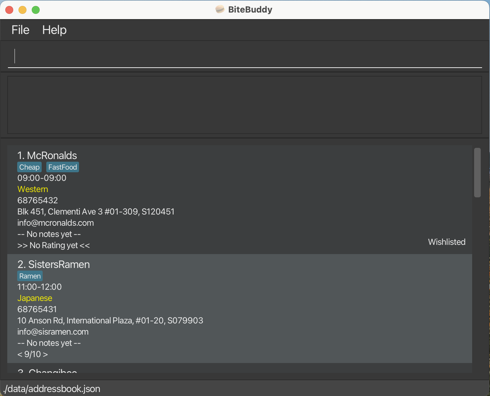

# BiteBuddy User Guide

_Have you ever tried thinking back to that amazing food place you had before, but couldn't quite get a hold of it before it slipped your mind?_<br>
_Or maybe you've just visited that newest food street, but didn't have enough time to try everything you wanted?_<br>

_Not to worry, because your **BiteBuddy** is here!_

BiteBuddy (BB) is our **food-place tracking app for recording all your food places, optimized for use via a Command Line Interface** (CLI).  While still having the benefits of a Graphical User Interface (GUI), BiteBuddy is a CLI-oriented application, meaning the faster you type, the faster BiteBuddy goes!<br>
BiteBuddy is **designed by foodies, for the foodies**! Add your go-to _(and not so favourite)_ food places so that you know exactly where to revisit _(and to avoid)_ in future! BiteBuddy minimally requires the name and address of a place but for the more adventurous users, you can expand more on the place such as:
- Jotting additional notes for your food places!
- Tagging your entries for identifying overlaps between places with a quick glance!
- Adding a rating so you know exactly where that restaurant stands in your own records!
- and more!

<br>For the power users, there are even more things to explore, including:
- Adding new food places with all additional features in one inline command
- Finding keyword matches across all your food places in a blink of an eye
- Edit any entry any time to fix those pesky typos
- Use the `find` command to filter results, before chaining the `edit` command on the filtered results!

Curious? Give the app a try!<br>
Check out the [Quick Start](#quick-start) section right below!

<!-- * Table of Contents -->
<page-nav-print />

--------------------------------------------------------------------------------------------------------------------

## Quick start

1. Ensure you have Java `17` or above installed in your Computer.<br>
   **Mac users:** Ensure you have the precise JDK version prescribed [here](https://se-education.org/guides/tutorials/javaInstallationMac.html).

1. Download the latest `.jar` file from [here](https://github.com/se-edu/addressbook-level3/releases).

1. Copy the file to the folder you want to use as the _home folder_ for your AddressBook.

1. Open a command terminal, `cd` into the folder you put the jar file in, and use the `java -jar addressbook.jar` command to run the application.<br>
   A GUI similar to the below should appear in a few seconds. Note how the app contains some sample data.<br>
   

1. Type the command in the command box and press Enter to execute it. e.g. typing **`help`** and pressing Enter will open the help window.<br>
   Some example commands you can try:

   * `list` : Lists all contacts.

   * `add n/John Doe p/98765432 e/johnd@example.com a/John street, block 123, #01-01` : Adds a contact named `John Doe` to BiteBuddy.

   * `delete 3` : Deletes the 3rd contact shown in the current list.

   * `clear` : Deletes all contacts.

   * `exit` : Exits the app.

1. Refer to the [Features](#features) below for details of each command.

--------------------------------------------------------------------------------------------------------------------

## Features

<box type="info" seamless>

**Notes about the command format:**<br>

* Words in `UPPER_CASE` are the parameters to be supplied by the user.<br>
  e.g. in `add n/NAME`, `NAME` is a parameter which can be used as `add n/John Doe`.

* Items in square brackets are optional.<br>
  e.g `n/NAME [t/TAG]` can be used as `n/John Doe t/friend` or as `n/John Doe`.

* Items with `…`​ after them can be used multiple times including zero times.<br>
  e.g. `[t/TAG]…​` can be an empty space (` `, i.e. 0 times), `t/friend`, `t/friend t/family` etc.

* Parameters can be in any order.<br>
  e.g. if the command specifies `n/NAME p/PHONE_NUMBER`, `p/PHONE_NUMBER n/NAME` is also acceptable.

* Extraneous parameters for commands that do not take in parameters (such as `list`, `exit` and `clear`) will be ignored.<br>
  e.g. if the command specifies `list 123`, it will be interpreted as `list`.

* If you are using a PDF version of this document, be careful when copying and pasting commands that span multiple lines as space characters surrounding line-breaks may be omitted when copied over to the application.
</box>

---

### Viewing help : `help`

Displays detailed information about BiteBuddy or specific commands.

Format: `help [COMMAND]`

```
help: Shows program usage instructions.
Parameters: [COMMAND] 
Example: help
Example: help find
```

* If no command is given, the URL for the help page will be shown. 
* If a command parameter is given, the usage for the command will be shown instead.
* Command keywords are **case-sensitive**.

Examples:  
* `help` shows the help page
* `help add` shows the usage for the `add` command

---

### Adding a foodplace: `add`

Adds a new foodplace entry to BiteBuddy.

Format: `add n/NAME a/ADDRESS [p/PHONE_NUMBER] [e/EMAIL] [t/TAG]… [no/NOTE] [r/RATING]​`

```
add: Adds a foodplace to BiteBuddy. Parameters: n/FOODPLACE NAME p/PHONE e/EMAIL a/ADDRESS [t/TAG]... [no/NOTE] [r/RATE]
Example: add n/Prata place p/98765432 e/pratad@example.com a/311, Clementi Ave 2, #02-25 t/Indian t/Cheap no/Famous for tandoori chicken r/9
```

<box type="tip" seamless>

**Tip:** A foodplace entry can have any number of tags (including none).
</box>

Examples:
* `add n/McRonalds a/John street, block 123, #01-01`
* `add n/Sisters Ramen a/International Plaza, #01-20 t/Ramen e/info@sisramen.com p/68765431 t/Soup`

<image src="images/ug_add.png">

---

### Listing all foodplaces : `list`

Shows a list of all foodplace entries in BiteBuddy.

Format: `list`

```
list: Lists all foodplaces in BiteBuddy.
Example: list
```

<image src="images/ug_list.png">

---

### Deleting a foodplace : `delete`

Deletes the specified foodplace entry from BiteBuddy.

Format: `delete INDEX`

```
delete: Deletes the foodplace identified by the index number used in the displayed foodplace list.
Parameters: INDEX
Example: delete 1
```

* Deletes the foodplace at the specified `INDEX`.
* The index refers to the index number shown in the displayed foodplace list. Alternatively, it can be an index number from after using the `find` command.
* The index **must be a positive integer**: 1, 2, 3, …​

Examples:
* `list` followed by `delete 2` deletes the 2nd foodplace.
* `find Betsy` followed by `delete 1` deletes the 1st foodplace in the results of the `find` command.

<image src="images/ug_delete.png">

---

### Editing a foodplace : `edit`

Edits an existing foodplace entry in BiteBuddy.

Format: `edit INDEX [n/NAME] [p/PHONE] [e/EMAIL] [a/ADDRESS] [t/TAG]… [no/NOTE] [r/RATING]​`

```
edit: Edits the details of the foodplace identified by the index number used in the displayed foodplace list. Existing values will be overwritten by the input values.
Parameters: INDEX [n/FOODPLACE NAME] [p/PHONE] [e/EMAIL] [a/ADDRESS] [t/TAG] [no/NOTE][r/RATING]...
Example: edit 1 p/91234567 e/johndoe@example.com
```

* Edits the foodplace at the specified `INDEX`. 
* The index refers to the index number shown in the displayed foodplace list.  Alternatively, it can be an index number from after using the `find` command.
* The index **must be a positive integer**: 1, 2, 3, …​
* **At least one of the optional fields** must be provided.
* Existing values will be updated to the input values.
* When editing tags, the **existing tags of the foodplace will be removed**: adding of tags is **not cumulative**.
* You can **remove all the foodplace’s tags** by typing `t/` without
    specifying any tags after it.

Examples:
*  `edit 1 p/91234567 e/johndoe@example.com` edits the phone number and email address of the 1st foodplace to be `91234567` and `johndoe@example.com` respectively.
*  `edit 2 n/Betsy Crower t/` edits the name of the 2nd foodplace to be `Betsy Crower` and deletes all existing tags.

<image src="images/ug_edit.png">

---

### Adding a note to a foodplace : `note`

Adds / edits the note of an existing foodplace in BiteBuddy.

Format: `note INDEX [note]`

```
note: Edits the notes of the foodplace identified by the index number used in the last foodplace listing. Existing notes will be overwritten by the input.
Empty notes erase the current note in foodplace.
Parameters: INDEX note [INDEX] [NOTE]
Example: note 1 Very good customer service
Restrictions: 100 characters limit
```

* Edits the foodplace at the specified `INDEX`.
* The index refers to the index number shown in the displayed foodplace list.  Alternatively, it can be an index number from after using the `find` command.
* The index **must be a positive integer**: 1, 2, 3, …​
* You can **remove the foodplace’s notes** by not specifying any notes after `INDEX`.
* Note have a **maximum character limit of 100**.
* Note only allows **ASCII-printable characters**. You may refer to [here](http://facweb.cs.depaul.edu/sjost/it212/documents/ascii-pr.htm) for the characters that are accepted.

Examples:
* `note 2 Good customer service!` adds / updates the note of the 2nd foodplace to be `Good customer service!`.
* `note 2` removes any notes of the 2nd foodplace.

<image src="images/ug_note.png">

---

### Rate a foodplace : `rate`

Adds / edits a rating from the specified foodplace in BiteBuddy.

Format: `rate INDEX RATING`

```
rate: Edits the rating of the foodplace identified by the index number used in the last foodplace listing. INDEX and RATING must be a positive integer. Existing rating will be overwritten by the input.
Parameters: INDEX RATING
Example: rate 5 1
```

* Edits the foodplace at the specified `INDEX`.
* The index refers to the index number shown in the displayed foodplace list. Alternatively, it can be an index number from after using the find command.
* The index **must be a positive integer**: 1, 2, 3, …​
* Sets the rating of the found foodplace to the specified `RATING`.
* The rating **must be an integer between 0 and 10**: 0, 1, 2, …​

Examples:
* `rate 2 5` sets the 2nd foodplace to have a rating of 5.
* `rate 3 0` sets the 3rd foodplace to have its current rating removed.
* `rate 1 5` followed by `rate 1 8` sets the 1st foodplace to have its current rating to `5`
  first then to `8`.

<image src="images/ug_rate.png">

---

### Adding a tag a foodplace : `tag`

Adds or removes one or more tags from the specified foodplace in BiteBuddy.

```
tag: Adds or deletes tag(s) for the foodplace identified by the index number shown in the displayed foodplace list.
Existing tags will be preserved when adding, and duplicate tags (case-insensitive) will be ignored.

Format:
  tag INDEX TAG1 [TAG2]...      -> Add new tag(s)
  tag INDEX /d                  -> Delete all tags
  tag INDEX /d TAG1 [TAG2]...   -> Delete only the specified tag(s)
```

Format 1 : `tag INDEX TAG1 [TAG2]...`  
Format 2 : `tag INDEX /d [TAG1] [TAG2]...`

* Finds the foodplace at the specified `INDEX` and edits its tags.
* **At least one tag** must be provided for **Format 1**.
* Tag additions are **cumulative**, existing tags are kept until manually deleted.

Examples:  
* `tag 3 FastFood Vegan` adds both FastFood and Vegan tags to the 3rd foodplace.
* `tag 2 /d FastFood` removes the FastFood tag from the 2nd foodplace.

<box type="tip" seamless>

**Tip:** Using `tag INDEX /d` without specifying any tags will remove all tags from the selected foodplace.
</box>

<image src="images/ug_tag.png">

---

### Locating foodplaces by name: `find`

Finds foodplaces whose name, phone, email, address, note, rating, or tags contain any of the given keywords.

Format: `find KEYWORD [MORE_KEYWORDS]`

```
find: Finds all foodplaces whose entries contain any of the specified keywords (case-insensitive) and displays them as a list with index numbers.
Parameters: KEYWORD [MORE_KEYWORDS]...
Example: find western cheap aircon
```

* The search is **case-insensitive**: `prata` will match `Prata`
* The **order** of the keywords does **not matter**: `Prata Place` will match `Place Prata`
* Keywords are **matched against multiple fields**.
* The search uses **substring matching**: `Pr` will match `Prata`
* Foodplaces **matching at least one keyword** will be returned (i.e. `OR` search).

Examples:
* `find prata` returns `Prata Place` and `The Prata House`.
* `find delivery 5` returns foodplaces with either “delivery” or “5” appearing in any field.<br>

<image src="images/ug_find.png">

---

### Clearing all entries : `clear`

Clears all entries from BiteBuddy.

Format: `clear`

```
clear: Clears BiteBuddy.
Example: clear
```

---

### Exiting the program : `exit`

Exits the program.

Format: `exit`

```
exit: Exits the program.
Example: exit
```

---

### Saving the data

BiteBuddy data is saved in the hard disk automatically after any command that changes the data. There is no need to save manually.

### Editing the data file

BiteBuddy data is saved automatically as a JSON file `[JAR file location]/data/addressbook.json`. Advanced users are welcome to update data directly by editing that data file.

<box type="warning" seamless>

**Caution:**
If your changes to the data file makes its format invalid, BiteBuddy will discard all data and start with an empty data file at the next run.  Hence, it is recommended to take a backup of the file before editing it.<br>
Furthermore, certain edits can cause the BiteBuddy to behave in unexpected ways (e.g., if a value entered is outside the acceptable range). Therefore, edit the data file only if you are confident that you can update it correctly.
</box>

### Archiving data files `[coming in v2.0]`

_Details coming soon ..._

--------------------------------------------------------------------------------------------------------------------

## FAQ

**Q**: How do I transfer my data to another Computer?<br>
**A**: Install the app in the other computer and overwrite the empty data file it creates with the file that contains the data of your previous BiteBuddy home folder.

--------------------------------------------------------------------------------------------------------------------

## Known issues

1. **When using multiple screens**, if you move the application to a secondary screen, and later switch to using only the primary screen, the GUI will open off-screen. The remedy is to delete the `preferences.json` file created by the application before running the application again.
2. **If you minimize the Help Window** and then run the `help` command (or use the `Help` menu, or the keyboard shortcut `F1`) again, the original Help Window will remain minimized, and no new Help Window will appear. The remedy is to manually restore the minimized Help Window.

--------------------------------------------------------------------------------------------------------------------

## Command summary

Action     | Format, Examples
-----------|----------------------------------------------------------------------------------------------------------------------------------------------------------------------
**Help**   | `help [COMMAND]` <br> e.g., `help add`
**Add**    | `add n/NAME p/PHONE_NUMBER e/EMAIL a/ADDRESS [t/TAG]…​` <br> e.g., `add n/James Ho p/22224444 e/jamesho@example.com a/123, Clementi Rd, 1234665 t/friend t/colleague`
**List**   | `list`
**Delete** | `delete INDEX`<br> e.g., `delete 3`
**Edit**   | `edit INDEX [n/NAME] [p/PHONE_NUMBER] [e/EMAIL] [a/ADDRESS] [t/TAG]…​`<br> e.g.,`edit 2 n/James Lee e/jameslee@example.com`
**Note**   | `note INDEX [NOTE]`<br> e.g., `note 1 Famous for their chicken rice!`
**Rate**   | `rate INDEX RATING`<br> e.g., `rate 1 6`
**Tag**    | `tag INDEX TAG1 [TAG2]…​`<br> `tag INDEX /d [TAG]…​`<br> e.g., `tag 1 FastFood Expensive`<br> e.g., `tag 1 /d FastFood`
**Find**   | `find KEYWORD [MORE_KEYWORDS]`<br> e.g., `find James Jake`
**Clear**  | `clear`
**Exit**   | `exit`
