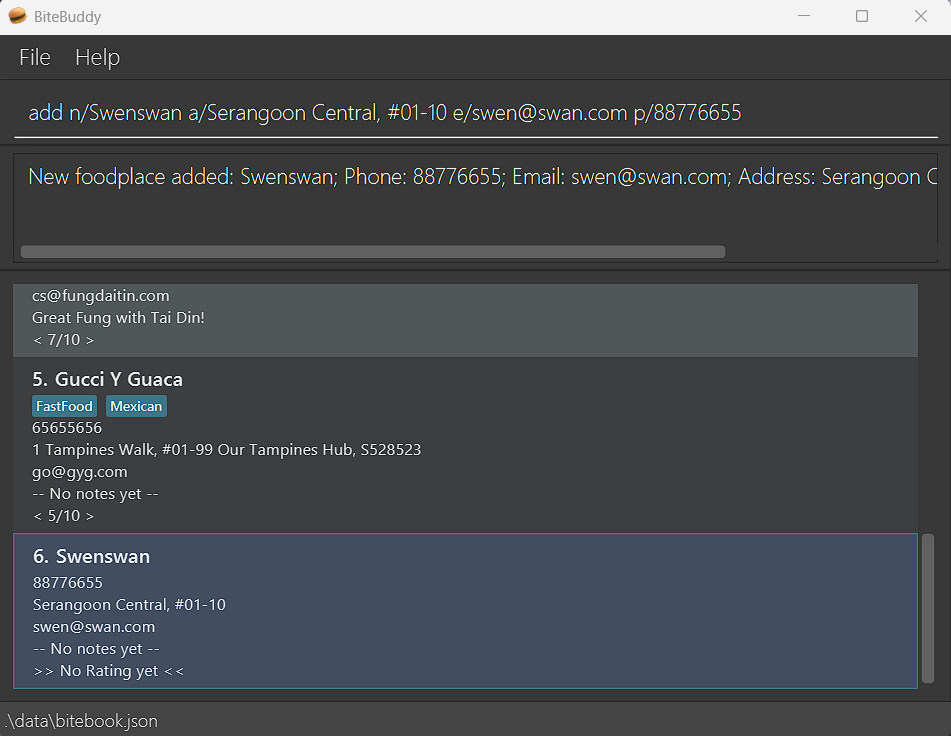
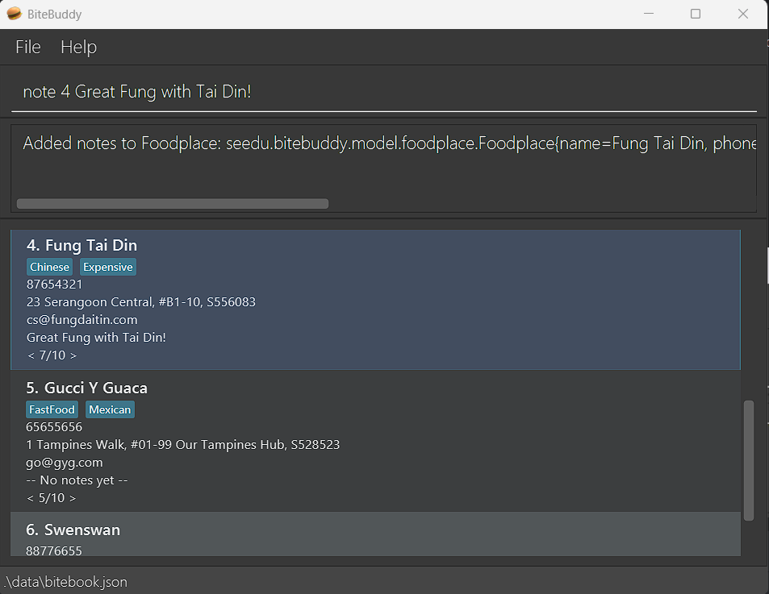
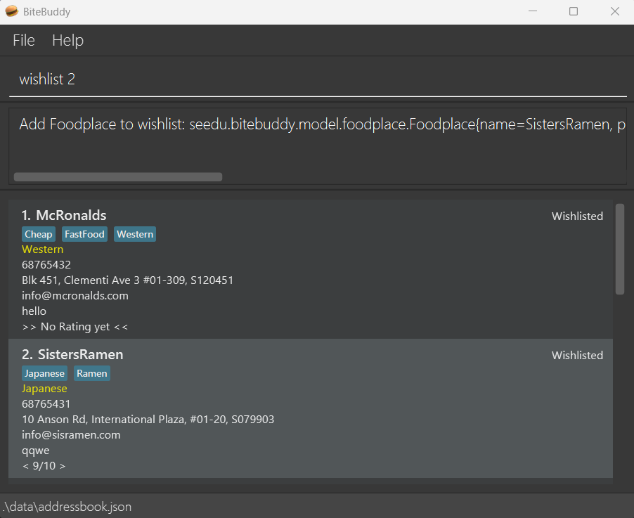
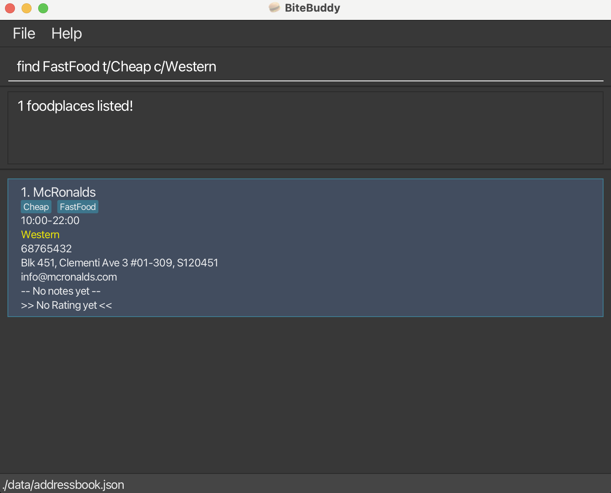

# BiteBuddy User Guide

## Table of contents
- [Introduction](#introduction)
- [Quick Start](#quick-start)
- [Features](#features)
  - [`help` - Viewing help](#viewing-help-help)
  - [`add` - Adding a foodplace](#adding-a-foodplace-add)
  - [`list` - Listing all foodplaces](#listing-all-foodplaces-list)
  - [`delete` - Deleting a foodplace](#deleting-a-foodplace-delete)
  - [`edit` - Editing a foodplace](#editing-a-foodplace-edit)
  - [`note` - Adding a note to a foodplace](#adding-a-note-to-a-foodplace-note)
  - [`rate` - Rating a foodplace](#rating-a-foodplace-rate)
  - [`tag` - Tagging a foodplace](#adding-tags-to-a-foodplace-tag)
  - [`wishlist` - Wishlisting a foodplace](#wishlisting-a-foodplace-wishlist)
  - [`blacklist` - Blacklisting a foodplace](#blacklisting-a-foodplace-blacklist)
  - [`pin` - Pinning a foodplace](#pinning-a-foodplace-pin)
  - [`unpin` - Unpinning a foodplace](#unpinning-a-foodplace-unpin)
  - [`find` - Finding a foodplace](#finding-a-foodplace-find)
  - [`compare` - Compare two foodplaces](#comparing-two-foodplaces-compare)
  - [`clear` - Delete all foodplaces](#clearing-all-entries-clear)
  - [`exit` - Quit the program](#exiting-the-program-exit)
- [FAQ](#faq)
- [Known issues](#known-issues)
- [Command summary](#command-summary)
- [Glossary](#glossary)

## Introduction

_Have you ever tried thinking back to that amazing foodplace you had before, but couldn't quite get a hold of it before it slipped your mind?_ 
_Or maybe you've just visited that newest food street, but didn't have enough time to try everything you wanted?_ 

_Not to worry, because your **BiteBuddy** is here!_

BiteBuddy (BB) is our **food-place tracking app for recording all your foodplaces, optimized for use via a Command Line Interface** (CLI).  While still having the benefits of a Graphical User Interface (GUI), BiteBuddy is a CLI-oriented application, meaning the faster you type, the faster BiteBuddy goes! 
BiteBuddy is **designed by foodies, for the foodies**! Add your go-to _(and not so favourite)_ foodplaces so that you know exactly where to revisit _(and to avoid)_ in future! BiteBuddy minimally requires the name and address of a place but for the more adventurous users, you can expand more on the place such as:
- Jotting additional notes for your foodplaces!
- Tagging your entries for identifying overlaps between places with a quick glance!
- Adding a rating so you know exactly where that restaurant stands in your own records!
- and more!

 For the power users, there are even more things to explore, including:
- Adding new foodplaces with all additional features in one inline command
- Finding keyword matches across all your foodplaces in a blink of an eye
For the power users, there are even more things to explore, including:
- Adding new food places with all additional features in one inline command
- Finding keyword matches across all your food places in a blink of an eye
- Edit any entry any time to fix those pesky typos
- Use the `find` command to filter results, before chaining the `edit` command on the filtered results!

Curious? Give the app a try! 
**New users** should check out the [Quick Start](#quick-start) section right below! 
*Power users* can jump straight into the commands [here](#viewing-help-help)!

<!-- * Table of Contents -->
<page-nav-print />

--------------------------------------------------------------------------------------------------------------------

## Quick Start

Follow these steps to install and start using **BiteBuddy**!

### Step 1 — Check Java Version
- Check that you have Java `17` or above installed on your computer. 
   **On Windows 🪟:** Java `17` can be downloaded [here](https://www.oracle.com/java/technologies/downloads/#java17-windows). 
   **On Mac 🍎:** Follow the JDK installation guide [here](https://se-education.org/guides/tutorials/javaInstallationMac.html).
- To check your Java version on any system, open a terminal and type: `java -version`

### Step 2 — Download and Run BiteBuddy
1. Head over to our GitHub Releases page [here](https://github.com/AY2526S1-CS2103T-W14-2/tp/releases)!
2. Download the latest file named **`bitebuddy.jar`**. There may be other files shown, but you'll only need `bitebuddy.jar`.
   
3. Choose a folder you want to use as the **home folder** for your BiteBuddy installation, choosing an empty folder is preferred! Then, place `bitebuddy.jar` in this folder.
4. Open a command terminal in the folder where you placed `bitebuddy.jar`: 
    - **Recommended:** In your file explorer, right-click an empty space and select **“Open in Terminal”** to start a command terminal directly from this folder. 
    - **If the above didn't work:** Open a command terminal (`cmd` for Windows or `Terminal` for Mac), then type in `cd YOUR/FILE/PATH` (replacing `YOUR/FILE/PATH` with the path to the folder holding `bitebuddy.jar`) and hit your 'Enter' key. 

   **Mac users:** 
   **Windows users:** 

5. In the terminal, type the command `java -jar "bitebuddy.jar"` and hit your 'Enter' key to start BiteBuddy!

6. After BiteBuddy starts, you'll soon be greeted by a window similar to the one below. There'll be some sample foodplaces provided to get you started!  
   

### Step 3 — Try Out a Command!
- To get started, in the Command Box, try typing **`help`** and hitting 'Enter' to open the help window! 
  This will be how commands are run: *type a command in the Command Box and press the 'Enter' key to execute it*. 
  Here are some example commands you can try to get the ball rolling:

   * `list` : This shows you all foodplaces in BiteBuddy!

   * `add n/KFC a/John street, block 123, #01-01 t/FastFood t/Chicken r/8` : This adds a new foodplace called *KFC* to BiteBuddy.

   * `delete 3` : This deletes the 3rd foodplace shown in the current list.

   * `find KFC` : This gets a list of all places that have the keyword '*KFC*' in BiteBuddy.

   * `exit` : This saves BiteBuddy's data and exits BiteBuddy.

- For details of each command, refer to the [Features](#features) below.

--------------------------------------------------------------------------------------------------------------------

## Features

<box type="tip" header="Using previously entered commands">

* Hate retyping commands? Press the `↑` / `↓` arrow keys in the command box!

* Swap between your previously-used and currently-typing-in-progress commands!

</box>

<box type="info" header="Some notes about the command format" seamless>

*For new users, check out the Glossary [here](#glossary) first!*

* You must replace the words in `UPPER_CASE` with your inputs. Different parameters have different rules, so check out the commands' section below first if you need help! 
  - In `delete INDEX`, `INDEX` is a required item here and `delete` expects a numerical item, so you can use the command as `delete 3`.

* Items in square brackets are optional, meaning you don't always have to provide these! 
  - In the items `n/NAME [t/TAG]`, they can be used as either `n/KFC t/fried` or `n/KFC`.
  - In the item pair `[ot/OPENING_TIME ct/CLOSING_TIME]`, both items must be present to be used, you can't leave either out! 
    A valid example for this item pair you can try is `ot/12:00 ct/22:00`.

* You can use items with a trailing `…`​ any number of times, including removing them. 
  - `[t/TAG]…​` can be an empty space (` `, i.e. 0 times), `t/famous`, `t/famous t/hawker`, etc.

* The order of all the items doesn't matter. 
  - If the command specifies `n/NAME p/PHONE_NUMBER`, `p/PHONE_NUMBER n/NAME` is also accepted!

* For commands that have required items (i.e. without square brackets), you must minimally provide all items the command requires!
  - For the `add n/NAME a/ADDRESS [p/PHONE_NUMBER] <shortened for brevity>…` command, you have to provide both `NAME` and `ADDRESS`, but `PHONE_NUMBER` is optional!
  - A pair of valid examples are `add n/HFC a/1 Seasame Street` and `add n/OlDonald a/10 Dimmsdale Avenue`.

* For commands that do not accept any items (e.g. `list`, `exit`, `clear`), if provided then these items will be ignored! 
  - If the command specifies `list 123`, it will be interpreted as just `list`.

* If you are providing any timings, they must all follow the HH:mm 24-hour format! 
  - 12pm should be typed as `12:00` and 7pm should be typed as `19:00`.

<box type="warning">
* If you are using a PDF version of this document, be careful when copying and pasting commands that span multiple lines as space characters surrounding line-breaks may be omitted when copied over to the application.
</box>

</box>

---

### Viewing help: `help`

Want to try something new, but don't know what's available? Use **help** to find more information about BiteBuddy! 
If you've got a command in mind but have a tough time figuring it out, you can also ask BiteBuddy, who's more than willing
to help!

Format: `help [COMMAND]`

* If no command is given, the URL for the help page will be shown. 
* If a command parameter is given, the usage for the command will be shown instead.
* Command keywords are **case-sensitive**.

Examples:
* `help` shows the help page
* `help add` shows the usage for the `add` command

[Go to Command Summary](#command-summary)

---

### Adding a foodplace: `add`

Just had the most satisfying meal of your day with the intention of coming back in future? 
You should **add** a new foodplace to BiteBuddy right before the food coma kicks in! *(He's always hungry for more!)*

Format: `add n/NAME a/ADDRESS [ot/OPENING_TIME ct/CLOSING_TIME] [p/PHONE_NUMBER] [e/EMAIL] [c/CUISINE] [no/NOTE] [r/RATING] [t/TAG]…​`

Examples:
* `add n/McRonalds a/John street, block 123, #01-01`
* `add n/Sisters Ramen a/International Plaza, #01-20 t/Ramen e/info@sisramen.com p/68765431 t/Soup`

[Go to Command Summary](#command-summary)

---

### Listing all foodplaces: `list`

Sometimes, we all have to check if all of our things are still there! *(Especially foodplaces, no excuses!)* 
Let BiteBuddy pull out the **list** of all foodplaces!

Format: `list`

[Go to Command Summary](#command-summary)

---

### Deleting a foodplace: `delete`

Sometimes, it's best to forget ever having visited a foodplace, especially one that you wished you never knew. 
**Delete** any foodplace entry from the current list, no questions asked!

Format: `delete INDEX`

* Deletes the foodplace at the specified `INDEX`.
* The index refers to the index number shown in the displayed foodplace list. Alternatively, it can be an index number from after using the `find` command.
* The index **must be a positive integer**: 1, 2, 3, …​

Examples:
* `list` followed by `delete 2` deletes the 2nd foodplace.
* `find KFC` followed by `delete 1` deletes the 1st foodplace in the results of the `find` command.

[Go to Command Summary](#command-summary)

---

### Editing a foodplace: `edit`

Did your cat roll over your keyboard when you turned away for a split-second? 
BiteBuddy understands, so go ahead and **edit** any foodplace entry whenever!

Format: `edit INDEX [n/NAME] [a/ADDRESS] [p/PHONE] [e/EMAIL] [ot/OPENING_TIME ct/CLOSING_TIME] [c/CUISINE] [no/NOTE] [r/RATING] [t/TAG]…​`

* Edits the foodplace at the specified `INDEX`.
* **At least one of the optional fields** must be provided.
* Existing values will be updated to the input values.
* When editing tags, the **existing tags of the foodplace will be removed**: adding of tags is **not cumulative**.
* You can **remove all the foodplace’s tags** by typing `t/` without
    specifying any tags after it.
* If updating opening/closing timing, both fields must be present.

Examples:
*  `edit 1 p/91234567 e/order@mcdonalds.com` edits the phone number and email address of the 1st foodplace to be `91234567` and `order@mcdonalds.com` respectively.
*  `edit 2 n/KFC t/` edits the name of the 2nd foodplace to be `KFC` and deletes all existing tags.

[Go to Command Summary](#command-summary)

---

### Adding a note to a foodplace: `note`

Why make mental notes when BiteBuddy has a mental dictionary? 
You can add / edit the **note** for a foodplace in BiteBuddy!

Format: `note INDEX [NOTE]`

* Edits the foodplace at the specified `INDEX`.
* By not specifying any `[NOTE]`, you will **remove the foodplace’s notes**.
* A note has a **maximum character limit of 100**.
* A note only allows **ASCII-printable characters**. You may refer to [here](http://facweb.cs.depaul.edu/sjost/it212/documents/ascii-pr.htm) for the characters that are accepted.
* Only one note can exist per foodplace at a time. A new note assigned to a foodplace will replace the existing note.

Examples:
* `note 2 Good customer service!` adds / updates the note of the 2nd foodplace to be `Good customer service!`.
* `note 2` removes any notes of the 2nd foodplace.

[Go to Command Summary](#command-summary)

---

### Rating a foodplace: `rate`

Trust your food palate to know exactly how much you like a foodplace, and trust BiteBuddy to remember it for you! 
You can add / edit a *rating* for a foodplace in BiteBuddy!

Format: `rate INDEX RATING`

* Edits the foodplace at the specified `INDEX`.
* Sets the rating of the foodplace to the specified `RATING`.
* The rating must be **an integer between 0 and 10**: 0, 1, 2, …​
* If rating is 0, any existing rating will be removed from the foodplace.

Examples:
* `rate 2 5` sets the 2nd foodplace to have a rating of 5.
* `rate 3 0` sets the 3rd foodplace to have its current rating removed.
* `rate 1 5` followed by `rate 1 8` sets the 1st foodplace to have its current rating to `5`
  first then to `8`.

[Go to Command Summary](#command-summary)

---

### Adding Tags to a foodplace: `tag`

Ever walked into a japanese restaurant and ended up ordering the best Pizza and Fried Chicken you've had? 
BiteBuddy knows life can be confusing, so why not just add / remove one or more **tags** from a foodplace!

Format (2 types): 
\- `tag INDEX TAG1 [TAG2]...` 
\- `tag INDEX /d [TAG1] [TAG2]...`

* Finds the foodplace at the specified `INDEX` and edits its tags.
* Tags must be made of **any letters and numbers only**, meaning special characters like whitespaces and `/`, `-`, etc aren't allowed!
* Tag duplicates are case-insensitive and will be ignored!
* For the **1st format, at least one tag** must be provided.
* For the **2nd format**, the provided tag(s) will be deleted.
* Tag additions are **cumulative**, existing tags are kept until manually deleted.

Examples:
* `tag 3 FastFood Vegan` adds both FastFood and Vegan tags to the 3rd foodplace.
* `tag 2 /d FastFood` removes only the FastFood tag from the 2nd foodplace.
* `tag 1 /d` will remove all tags from the 1st foodplace.

[Go to Command Summary](#command-summary)

---

### Wishlisting a foodplace: `wishlist`

Have a foodplace that you've had your eye on for some time, but it just keeps getting buried by other foodplaces? 
Wishlist a foodplace in BiteBuddy so you can finally stop making excuses about forgetting all about it!

Format: `wishlist [INDEX]`

* Wishlists the foodplace at the specified `INDEX`.
* You can **display your wishlist** by not specifying an `INDEX`.
* If a foodplace is currently wishlisted, you can use `wishlist` on it again to **remove the wishlist status**.
* If a foodplace **is currently blacklisted**, adding this foodplace to wishlist **removes its blacklist status**.

Examples:
* `wishlist 2` wishlists the 2nd foodplace.
* `wishlist` displays all foodplaces that are wishlisted.

[Go to Command Summary](#command-summary)

---

### Blacklisting a foodplace: `blacklist`

Ever gone to a foodplace whose food made your stomach churn just from the thought of it? We definitely have! 
That's why we let you blacklist a foodplace in BiteBuddy too!

Format: `blacklist [INDEX]`

* Blacklists the foodplace at the specified `INDEX`.
* You can **display your blacklist** by not specifying an `INDEX`.
* If a foodplace is currently **blacklisted**, you can use `blacklist` on it again to **remove the blacklist status**.
* If a foodplace is currently **wishlisted**, adding this foodplace to blacklist **removes its wishlist status**.

Examples:
* `blacklist 2` Blacklists the 2nd foodplace.
* `blacklist` displays all foodplaces that are blacklisted.

[Go to Command Summary](#command-summary)

---

### Pinning a foodplace: `pin`

You can pin an existing unpinned foodplace in BiteBuddy for a quick reference! 
Pinned foodplaces always appear before regular foodplaces when applicable, so you'll never have to scroll too far to look for them!

Format: `pin INDEX`

* Pins the foodplace at the specified `INDEX`.
* Pinned foodplaces appear at the top of the displayed foodplace list, indicated by a pin icon in the top right corner.
* There can be a **maximum of 5** pinned foodplaces.

Examples:
* `pin 2` pins the 2nd foodplace.

[Go to Command Summary](#command-summary)

---

### Unpinning a foodplace: `unpin`

Changed your mind on a pinned foodplace, or gotten sick of it after trying it one time too many? 
You can also unpin an existing pinned foodplace in Bitebuddy!

Format: `unpin INDEX`

* Unpins the foodplace at the specified `INDEX`.

Examples:
* `unpin 1` unpins the 1st foodplace.

[Go to Command Summary](#command-summary)

---

### Finding a foodplace: `find`

Craving for something you've had, or need a quick refresh on a foodplace you've visited before? 
BiteBuddy can search for your keywords across all relevant fields to help you find it quickly!

Format: `find [KEYWORD]... [t/TAG [MORE TAGS]] [c/CUISINE] [r/RATING]`

* **At least one of the optional fields** must be provided.
* The search is **case-insensitive**: `prata` will match `Prata`
* The **order** of the keywords does **not matter**: `Prata Place` will match `Place Prata`
* Keywords are **matched against multiple fields**, including names, notes, addresses, etc.
* The search uses **substring matching**: `Pr` will match `Prata`
* Foodplaces **matching at least one keyword** will be returned (i.e. `OR` search).
* Tag, cuisine, and rating filters **must match exactly** (case-insensitive).
* Multiple tags use AND logic — all must be present.

Examples:
* `find prata` returns `Prata Place` and `The Prata House`.
* `find delivery 5` returns foodplaces with either “delivery” or “5” appearing in any field. 
* `find t/hawker restaurant` returns foodplaces tagged with both “hawker” and “restaurant”.
* `find delivery c/japanese r/8` returns Japanese foodplaces with rating 8 with delivery.

[Go to Command Summary](#command-summary)

---

### Comparing two foodplaces: `compare`

Torn between picking from two tough contenders for today's lunch, and can't trust your gut? 
Make a more informed decision by comparing the ratings and tags of any two foodplaces!

Format: `compare INDEX1 INDEX2`

* Compares the ratings of the two specified foodplaces.
* Displays common tags shared by both foodplaces.
* Displays unique tags for each foodplace.

Examples:
* `compare 1 3` returns a comparison summary between the 1st and 3rd foodplaces.

[Go to Command Summary](#command-summary)

---

### Clearing all entries: `clear`

Sometimes, there's just no hope for every foodplace on the list, and you're looking for a clean slate to start again. 
If you're dead set on clearing the list *after thinking about it long and hard*, you could clear all foodplaces from BiteBuddy 
*(although we wouldn't recommend it since we believe in second chances!)*.

Format: `clear`

<box type="warning">

* **This action is IRREVERSIBLY DESTRUCTIVE! Be extremely careful!**

</box>

[Go to Command Summary](#command-summary)

---

### Exiting the program: `exit`

Calling it a day after an exhausting day of *"reviewing"* delicacies from all over? 
BiteBuddy saves your progress automatically, so everything is safe.

Format: `exit`

[Go to Command Summary](#command-summary)

---

### Saving the data

BiteBuddy data is saved in the hard disk automatically after any command that changes the data. There is no need to save manually.

Closing BiteBuddy after running it for the first time with 1) no existing data folder and 2) without executing any commands also causes
this data folder with the JSON file to be generated. This is one of the 2 intended ways to generate the data file, the other being
whenever a command successfully executes for the first time.

### Editing the data file

BiteBuddy data is saved automatically as a JSON file `[JAR file location]/data/addressbook.json`. Advanced users are welcome to update data directly by editing that data file.

Users are intended to only edit BiteBuddy's JSON file when BiteBuddy is not open. On startup, if the JSON file exists,
BiteBuddy will only read all data from the JSON file **once** into the program's memory. No subsequent reads to this file  
are made, and successful commands will cause a write to this file. Closing BiteBuddy will cause the JSON file to be 
overwritten with BiteBuddy's latest data from the program.

Any external modifications to the JSON file will not influence a running instance of BiteBuddy. If any are made, when the running instance of BiteBuddy exits, it will overwrite all external modifications made and replace it with the program's data.

<box type="warning" seamless>

**Caution:**
If your changes to the data file makes its format invalid, BiteBuddy will discard all data and start with an empty data file at the next run.  Hence, it is recommended to take a backup of the file before editing it. 
Furthermore, certain edits can cause the BiteBuddy to behave in unexpected ways (e.g., if a value entered is outside the acceptable range). Therefore, edit the data file only if you are confident that you can update it correctly.

</box>

--------------------------------------------------------------------------------------------------------------------

## FAQ

**Q**: How do I transfer my data to another Computer? 
**A**: Install the app in the other computer and overwrite the empty data file it creates with the file that contains the data of your previous BiteBuddy home folder.

--------------------------------------------------------------------------------------------------------------------

## Known issues

1. **When using multiple screens**, if you move the application to a secondary screen, and later switch to using only the primary screen, the GUI will open off-screen. The remedy is to delete the `preferences.json` file created by the application before running the application again.
2. **If you minimize the Help Window** and then run the `help` command (or use the `Help` menu, or the keyboard shortcut `F1`) again, the original Help Window will remain minimized, and no new Help Window will appear. The remedy is to manually restore the minimized Help Window.

--------------------------------------------------------------------------------------------------------------------

## Command summary

Action     | Format                                                                                                                                 | Examples
-----------|----------------------------------------------------------------------------------------------------------------------------------------|---------------------------------------------------------------------------------------------------------------------------------------------------------
[**Help**](#viewing-help-help) | `help [COMMAND]`                                                                                                                    | `help add`, `help find`
[**Add**](#adding-a-foodplace-add) | `add n/NAME a/ADDRESS [ot/OPENING_TIME ct/CLOSING_TIME] [p/PHONE_NUMBER] [e/EMAIL] [c/CUISINE] [no/NOTE] [r/RATING] [t/TAG]…`       | `add n/James Cook Kitchen a/123, Clementi Rd, 1234665 p/22224444 e/chef@jamescook.com t/MasterChef t/Expensive`
[**List**](#listing-all-foodplaces-list) | `list`                                                                                                                                 | `list`
[**Delete**](#deleting-a-foodplace-delete) | `delete INDEX`                                                                                                                      | `delete 3`
[**Edit**](#editing-a-foodplace-edit) | `edit INDEX [n/NAME] [p/PHONE] [e/EMAIL] [a/ADDRESS] [ot/OPENING_TIME ct/CLOSING_TIME] [c/CUISINE] [no/NOTE] [r/RATING] [t/TAG]…​`  | `edit 2 n/James Lee Diner e/chef@jameslee.com`
[**Note**](#adding-a-note-to-a-foodplace-note)   | `note INDEX [NOTE]`                                                                                                                 | `note 1 Famous for their chicken rice!`
[**Rate**](#rating-a-foodplace-rate) | `rate INDEX RATING`                                                                                                                 | `rate 1 6`
[**Tag**](#adding-tags-to-a-foodplace-tag) | `tag INDEX TAG1 [TAG2]…​`  `tag INDEX /d [TAG]…​`                                                                                | `tag 1 FastFood Expensive`  `tag 1 /d FastFood`
[**Wishlist**](#wishlisting-a-foodplace-wishlist) | `wishlist [INDEX]`                                                                                                                  | `wishlist 2`  `wishlist`
[**Blacklist**](#blacklisting-a-foodplace-blacklist) | `blacklist [INDEX]`                                                                                                                 | `blacklist 2`  `blacklist`
[**Pin**](#pinning-a-foodplace-pin) | `pin [INDEX]`                                                                                                                       | `pin 1`
[**Unpin**](#unpinning-a-foodplace-unpin) | `unpin [INDEX]`                                                                                                                     | `unpin 2`
[**Find**](#finding-a-foodplace-find) | `find [KEYWORD]... [t/TAG [MORE TAGS]] [c/CUISINE] [r/RATING]`                                                | `find James Jake`  `find t/hawker c/japanese r/8`
[**Compare**](#comparing-two-foodplaces-compare) | `compare [INDEX1] [INDEX2]`                                                                                                         | `compare 1 3`
[**Clear**](#clearing-all-entries-clear) | `clear`                                                                                                                                | `clear`
[**Exit**](#exiting-the-program-exit) | `exit`                                                                                                                                 | `exit`

## Glossary

<box type="info" header="Glossary of terms in BiteBuddy">

*Alphanumeric characters include all lower & upper case letters and numbers only! (`[a-zA-Z0-9]`)*

**Items**: Refers to any input parameter that is accepted by any command 
\- Examples: `n/NAME`, `t/TAG`, `INDEX`, etc

<box type="tip" header="All Items">

- **INDEX**: The index refers to the index number shown in the displayed foodplace list.  Alternatively, it can be an index number from after using the `find` command.
  - **Must be a positive integer**: 1, 2, 3, …​
  - Must be an integer in the **range of the displayed Foodplace list**
    - Example: In a displayed list of 5 foodplaces, INDEX must be between 1 and 5

- **n/NAME**: Refers to the name of a Foodplace
  - The 1st character **cannot be a non-alphanumeric character**.
  - Contains only alphanumeric characters, whitespaces (` `) and certain special characters (`&,'-_@:$#!.`)

- **a/ADDRESS**: Refers to the address of a Foodplace
  - The 1st character **cannot be a space character**. All whitespace leading to a non-space character will be removed
  - All other characters of an address can be anything, there is no length limit

- **ot/OPENING_TIME**: Refers to the opening time of a Foodplace
  - Must form a pair with a **closing time** (see below)
  - Cannot be equal to the corresponding closing time
  - Must follow the **HH:mm 24-hour format**
    - Times with single-digit hours must be padded with a `0` prefix to become double-digit hours
    - Examples: `09:00` for 9am, `12:00` for 12pm, `19:00` for 7pm

- **ct/CLOSING_TIME**: Refers to the closing time of a Foodplace
  - Must form a pair with an **opening time** (see above)
  - Cannot be equal to the corresponding opening time
  - Must follow the **HH:mm 24-hour format**
    - Times with single-digit hours must be padded with a `0` prefix to become double-digit hours
    - Examples: `09:00` for 9am, `12:00` for 12pm, `19:00` for 7pm

- **p/PHONE_NUMBER**: Refers to the phone number linked to a Foodplace
  - Contains only numbers, no other characters allowed
  - Must be between 3 and 15 digits long
    - Examples: `999`, `98765432`, `1234432101`

- **e/EMAIL**: Refers to the email linked to a Foodplace
  - It must be in the format `LOCAL@DOMAINS`:
    - `LOCAL` contains only alphanumeric characters and `+_.-`, and the 1st character cannot be `+_.-`.
    - `DOMAINS` consist of at least one domain label(s) seperated by `.`
      - Must end with a domain label at least 2 characters long
      - Each domain label starts and ends with alphanumeric characters
      - Each domain label consists of alphanumeric characters, separated only by hyphens `-`, if any.

- **c/CUISINE**: Refers to the cuisine offered by a Foodplace
  - Contains only alphanumeric characters and spaces

- **no/NOTE**: Refers to the note linked to a Foodplace
  - Contains only ASCII printable characters [here](http://facweb.cs.depaul.edu/sjost/it212/documents/ascii-pr.htm)
  - Can be up to 100 characters long

- **r/RATING**: Refers to the score linked to a Foodplace
  - Contains only numbers
  - A valid rating must be between 1 and 10
  - A rating of 0 can be used for removing ratings in applicable commands (e.g. `rate`, `edit`, `add`, etc)

- **t/TAG**: Refers to the tags linked to a Foodplace
  - Contains only alphanumeric characters

</box>

[Return to Features](#features)

</box>

---

*“Pin 3” icon used in the application GUI by [Icons8](https://icons8.com), [CC BY-ND 3.0](https://creativecommons.org/licenses/by-nd/3.0/).*

